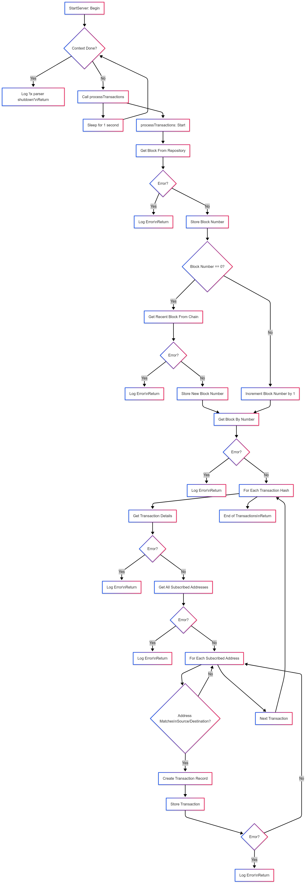

# Tx Parser


## Overview

Tx Parser is a Ethereum blockchain parser that will allow to query transactions for subscribed addresses
## Key Features

- API with versioned endpoints (`/txparser/v0`)
- Automated code generation from OpenAPI specification
- Built-in Swagger UI for interactive documentation
- Clean architecture implementation
- Makefile for simplified development workflow

## Getting Started

### Prerequisites

- [Go 1.23+](https://golang.org/dl/)
- [OpenAPI Generator](https://openapi-generator.tech/) (only needed for infrastructure regeneration)
- [Make](https://www.gnu.org/software/make/) (optional but recommended)

### Installation

```bash
git clone <repository-url>
cd txparser
```

### Running the application 

Start the server using either method:
```bash
make run
# OR
go run main.go start --configPath ./
```
The API will be available at http://localhost:8080


## API Documentation
### Swagger UI

The project includes built-in Swagger UI for interactive API exploration:

1. Start the server
    ```bash
    make run
    # OR
    go run main.go start --configPath ./
    ```
## Application Layer Structure: 
    ┌──────────────────────────────────────────────┐
    │ HTTP Interface                               │
    │ (Generated - pkg/infra/httpinfragenerated)   │
    └──────────────────────┬───────────────────────┘
                           │
                           ▼
    ┌──────────────────────────────────────────────┐
    │ HTTP Input Adapter                           │
    │ (Implements generated interface)             │
    └──────────────────────┬───────────────────────┘
                           │
                           ▼
    ┌──────────────────────────────────────────────┐
    │ Use Case Layer                               │
    │ (Contains all business logic)                │
    └──────────────────────────────────────────────┘
                           ┬
                           │
                           ▼
      ┌──────────────────────────────────────────────┐
      │ Output Adapter Layer (blockchain,            │
      │ , repositories)                              │
      └──────────────────────────────────────────────┘

## Flow



